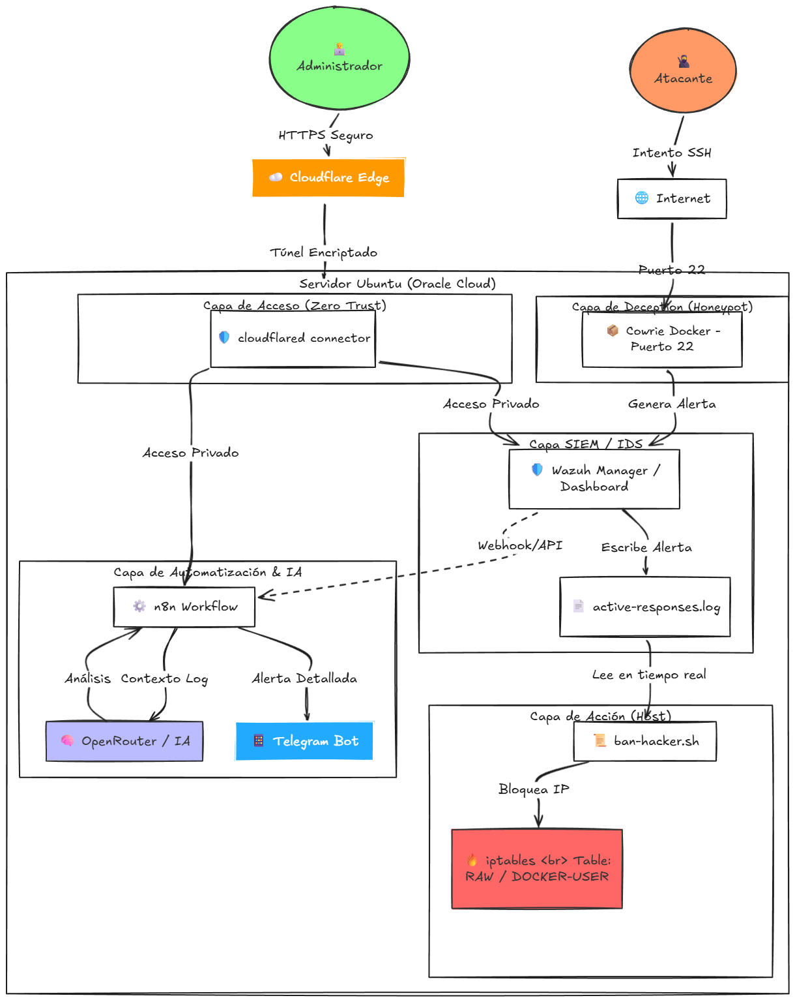

# 🛡️ Project AETHER: AI-Driven Deception & Defense System

AETHER is a proactive cybersecurity ecosystem deployed on **Oracle Cloud (OCI)**. It combines **Honey-Potting**, **SIEM (Wazuh)**, and **Generative AI** to automate threat detection and mitigation.

## 🚀 Key Features
- **Stealth Management:** Zero-exposure entry via **Cloudflare Tunnels**.
- **Active Deception:** Real-time SSH honeypot (Cowrie) on port 22.
- **Automated Response:** Kernel-level banning via **iptables** triggered by Wazuh.
- **AI Analytics:** Semantic log analysis using **OpenRouter (LLMs)** for threat attribution.

## 🏗️ Architecture

## 🛠️ Stack
- **Infrastructure:** Oracle Cloud (Ubuntu Instance).
- **Orchestration:** Portainer & Docker.
- **Intelligence:** n8n + AI Models (GPT-4o/Claude).
